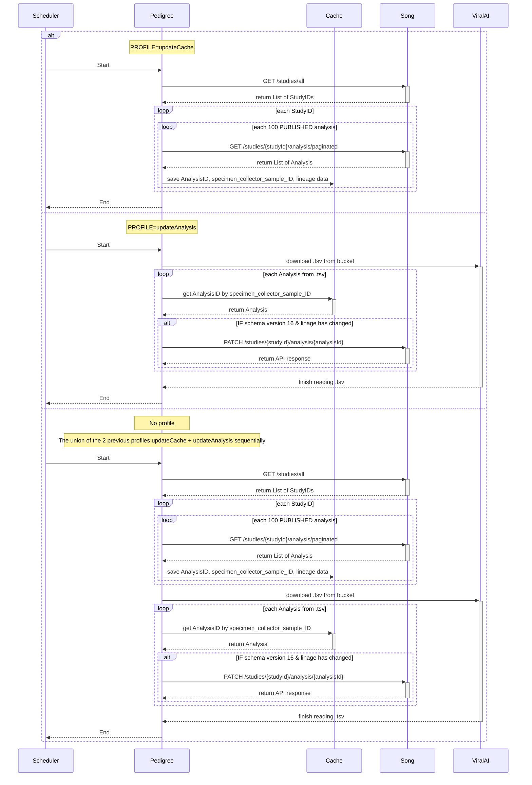

```mermaid
sequenceDiagram

    participant Scheduler
    participant Pedigree
    participant Cache
    participant Song

    alt

        note over Pedigree: PROFILE=updateCache

            Scheduler->>Pedigree: Start

            Pedigree->>+Song: GET /studies/all
            Song-->>-Pedigree: return List of StudyIDs
            loop each StudyID
                loop each 100 PUBLISHED analysis
                    Pedigree->>+Song: GET /studies/{studyId}/analysis/paginated
                    Song-->>-Pedigree: return List of Analysis

                    Pedigree->>Cache: save AnalysisID, specimen_collector_sample_ID, lineage data
                end
            end

        Pedigree-->>Scheduler: End

    else

        note over Pedigree: PROFILE=updateAnalysis

        Scheduler->>Pedigree: Start

            Pedigree->>+ViralAI: download .tsv from bucket

            loop each Analysis from .tsv
                Pedigree->>+Cache: get AnalysisID by specimen_collector_sample_ID
                Cache-->>-Pedigree: return Analysis


                alt IF schema version 16 & linage has changed

                    Pedigree->>+Song: PATCH /studies/{studyId}/analysis/{analysisId}
                    Song-->>-Pedigree: return API response

                end

            end

            ViralAI-->>-Pedigree: finish reading .tsv

        Pedigree-->>Scheduler: End

    else

        note over Pedigree: No profile

        note over Pedigree: The union of the 2 previous profiles updateCache + updateAnalysis sequentially

        Scheduler->>Pedigree: Start

            Pedigree->>+Song: GET /studies/all
            Song-->>-Pedigree: return List of StudyIDs
            loop each StudyID
                loop each 100 PUBLISHED analysis
                    Pedigree->>+Song: GET /studies/{studyId}/analysis/paginated
                    Song-->>-Pedigree: return List of Analysis

                    Pedigree->>Cache: save AnalysisID, specimen_collector_sample_ID, lineage data
                end
            end


            Pedigree->>+ViralAI: download .tsv from bucket

            loop each Analysis from .tsv
                Pedigree->>+Cache: get AnalysisID by specimen_collector_sample_ID
                Cache-->>-Pedigree: return Analysis


                alt IF schema version 16 & linage has changed

                    Pedigree->>+Song: PATCH /studies/{studyId}/analysis/{analysisId}
                    Song-->>-Pedigree: return API response

                end

            end

            ViralAI-->>-Pedigree: finish reading .tsv

        Pedigree-->>Scheduler: End

    end
```
